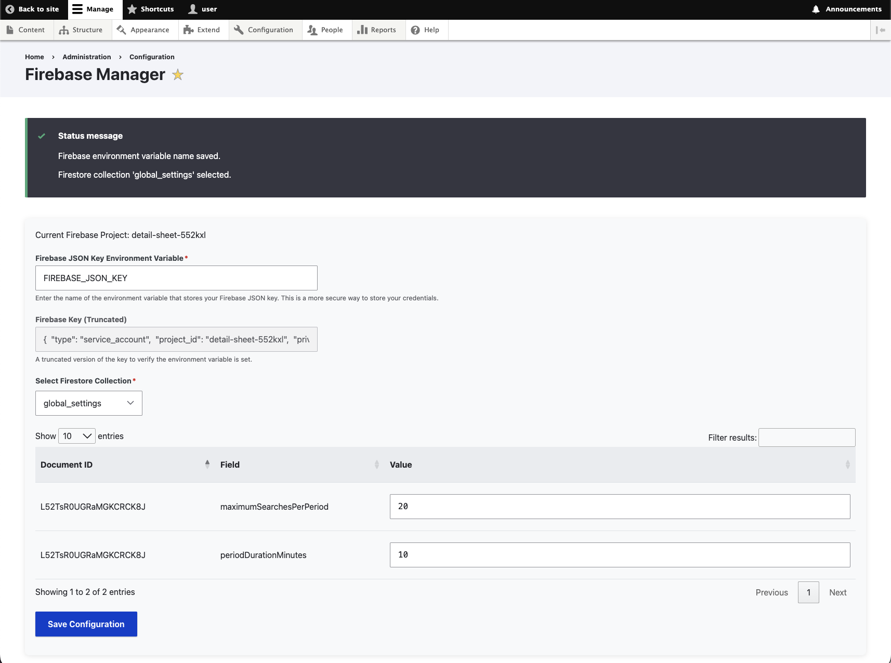
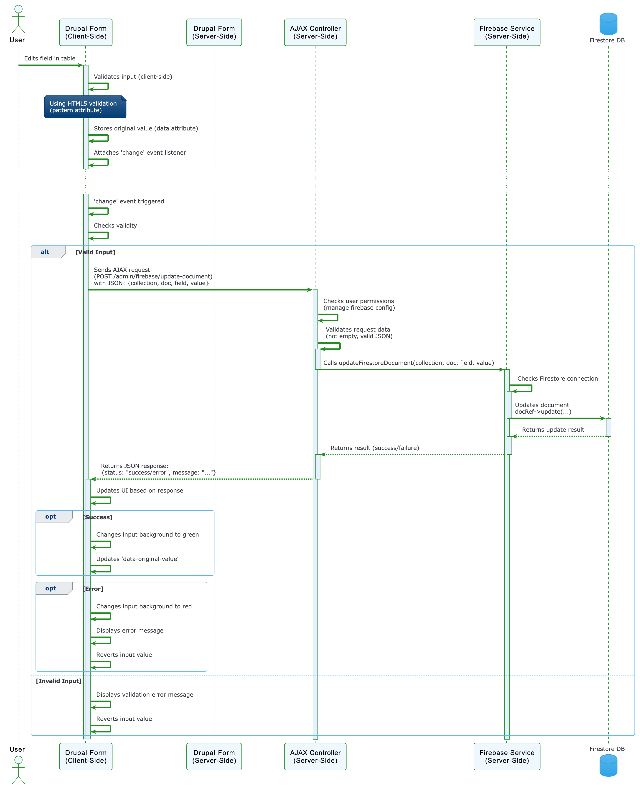

# Firebase Config Manager for Drupal

[](https://www.drupal.org/)
[](https://www.gnu.org/licenses/old-licenses/gpl-2.0.en.html)
[](/)  <!-- To be replace with CI Build Shortly -->

A Drupal module that provides a user-friendly interface for managing data within a Google Firebase Firestore database directly from the Drupal admin panel.  This module allows administrators to securely connect to Firestore, browse collections, and edit document fields.


## Features

*   **Secure Connection:** Securely connects to your Firebase project using service account credentials stored as an environment variable.  Credentials are *never* stored directly in the Drupal database.
*   **Dynamic Collection Browsing:**  Automatically lists available Firestore collections.
*   **Document Editing:**  Provides a table-based interface for viewing and editing string and integer fields within Firestore documents.
*   **Real-time Updates:** Changes made in the Drupal admin are immediately reflected in your Firestore database.
*   **Data Integrity:** Restricts editing to string and integer fields to prevent accidental data corruption.
*   **AJAX-Powered Interface:** Uses AJAX for a responsive user experience without full page reloads.
*   **Drupal Permissions Integration:**  Uses Drupal's permission system to control access to the module's features.
*   **Comprehensive Logging:** Logs all Firebase operations for auditing and troubleshooting.

## Module Screenshot



## Requirements

*   Drupal 10 or 11
*   Composer
*   A Google Firebase project with Firestore enabled.
*   A Firebase service account with appropriate permissions to access Firestore.

## Sequence Diagram



## Installation

1.  **Install via Composer (Recommended):**

    ```bash
    composer require drupal/firebase_config_manager
    ```
    This is the preferred method, as it automatically manages the required dependencies (`google/cloud-firestore` and `kreait/firebase-php`).

2.  **Manual Installation (If Necessary):**
    *   Place the `firebase_config_manager` directory in your Drupal `modules/contrib` directory.
    *   Ensure the `google/cloud-firestore` and `kreait/firebase-php` libraries are installed via Composer in your Drupal root directory:
       ```bash
       cd /path/to/your/drupal/root
       composer require google/cloud-firestore kreait/firebase-php
       ```

3.  **Enable the Module:** Go to `Admin > Extend` (or `/admin/modules`) and enable the "Firebase Config Manager" module.

## Configuration

1.  **Firebase Service Account:**
    *   In the Google Cloud Console ([https://console.cloud.google.com/](https://console.cloud.google.com/)), navigate to your Firebase project.
    *   Go to **Project settings > Service accounts**.
    *   Click **Generate new private key**. This will download a JSON file containing your service account credentials.
    *   **Important:**  *Do not* store this JSON file directly in your codebase.

2.  **Environment Variable:**
    *   Set an environment variable on your server (e.g., `FIREBASE_CONFIG`) to hold the *contents* of the JSON key file. The method for setting environment variables depends on your server environment (Bitnami, Apache virtual host, cPanel, etc.). Consult your hosting provider's documentation.

        *   **Example (Linux, .bashrc or .bash_profile):**
            ```bash
            export FIREBASE_CONFIG='{ ... your JSON key content ... }'
            ```
        *   **Example (Bitnami -  RECOMMENDED):**  Bitnami recommends using the `bnconfig` tool or modifying the `setenv.sh` file.  **This is the best approach for Bitnami.** See: [https://docs.bitnami.com/general/apps/drupal/administration/configure-environment-variables/](https://docs.bitnami.com/general/apps/drupal/administration/configure-environment-variables/)
            A common location for `setenv.sh` is `/opt/bitnami/apache/conf/vhosts/`.  You would add a line like this *inside* the virtual host configuration:

                ```bash
                SetEnv FIREBASE_CONFIG "{ ... your JSON key content ... }"
                ```
            *Restart Apache after setting the environment variable.*

        * **Example (.htaccess - NOT RECOMMENDED for security reasons):**
            ```
            SetEnv FIREBASE_CONFIG "{ ... your JSON key content ... }"
            ```
            Using `.htaccess` is generally *discouraged* for storing sensitive credentials. It's less secure than using server-level environment variables.

3.  **Drupal Configuration:**
    *   Go to `Configuration > Web services > Firebase Config Manager` (or `/admin/config/web-services/firebase`) in your Drupal admin.
    *   Enter the name of the environment variable you set (e.g., `FIREBASE_CONFIG`) in the "Firebase JSON Key Environment Variable" field.
    *   Click "Save Configuration".
    *   If the connection is successful, you'll see a dropdown to select a Firestore collection.  Choose the collection you want to manage.

## Usage

1.  After configuring the module and selecting a collection, the module will display a table of documents from that collection.
2.  You can edit the values of string and integer fields directly in the table.
3.  Changes are automatically saved to Firestore when you modify a field and move focus away from it (e.g., by clicking outside the input field or pressing Tab).
4.  Visual feedback (green background for success, red for error) indicates the status of the update.

## Permissions

*   **`administer site configuration`:**  Required to configure the Firebase environment variable (initial setup).
*   **`manage firebase config`:**  Required to view and edit Firestore documents.  Grant this permission to users who need to manage data in Firestore.

## Troubleshooting

*   **"Class 'Google\Cloud\Firestore\FirestoreClient' not found" error:**
    *   Ensure the `google/cloud-firestore` and `kreait/firebase-php` libraries are installed correctly via Composer.  Run `composer install` in your Drupal root directory.
    *   Clear the Drupal cache: `drush cr` (from within your module directory or Drupal root).
    *   Restart PHP-FPM: `sudo /opt/bitnami/ctlscript.sh restart php-fpm` (or the appropriate command for your server).
*   **"Missing parameters" error:**
    *   Check your browser's developer console (Network tab) to see the data being sent in the AJAX request.  Verify that `collection`, `doc`, `field`, and `value` are all present and correct.
    *   Check Drupal's recent log messages (`/admin/reports/dblog`) for more detailed error information.
*   **Menu link not appearing:**
    * Verify that `firebase_config_manager.links.menu.yml` exists and has the correct `route_name` (matching `firebase_config_manager.routing.yml`).
    *  Clear Drupal caches: `drush cr`
    * Ensure the user has the required `administer site configuration` permission.
*   **Data not saving to Firestore:**
    * Double-check your Firebase service account permissions in the Google Cloud Console.  Make sure it has write access to Firestore.
    * Inspect the Network tab in your browser's developer tools to see the response from the AJAX request.  Any errors from Firestore will be reported there.

## Security

*   **Never store your Firebase service account key directly in your code or Drupal's database.** Use environment variables, as described above.
*   Grant the `manage firebase config` permission only to trusted users.
