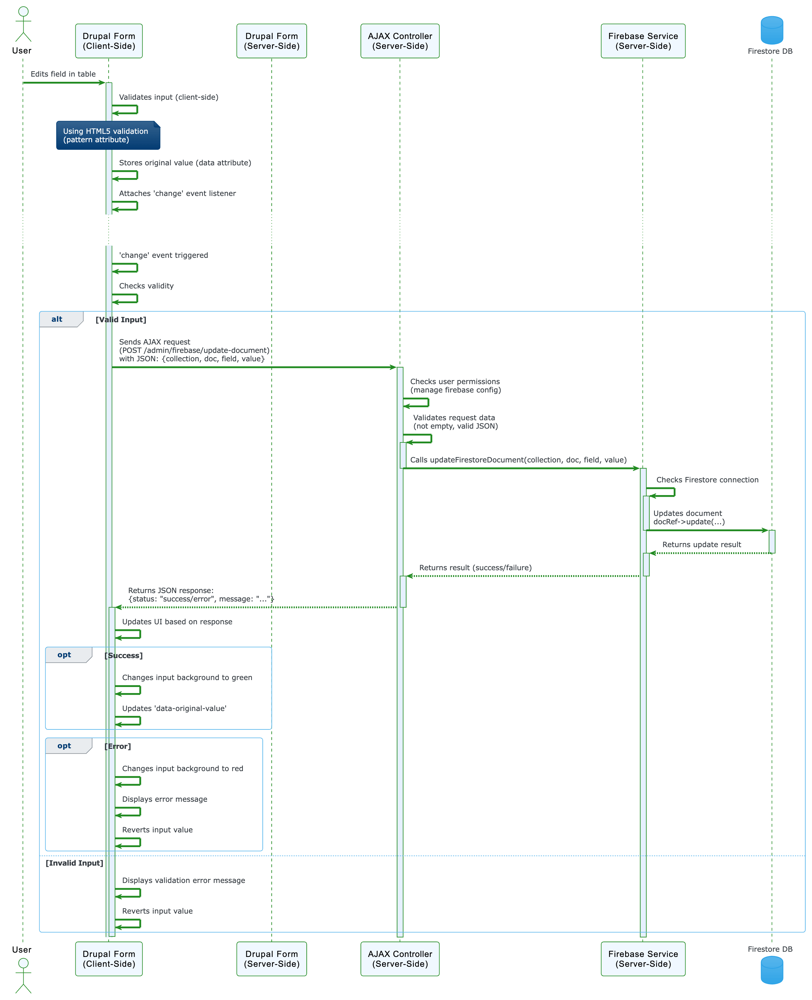

# Firebase Config Manager for Drupal 10 & 11

A **Drupal 10 & 11 module** for managing **Firebase Remote Config** and **Firestore database entries** via the Drupal admin interface.

## 🚀 Features

- **Secure Firebase Authentication**
  - Store Firebase credentials via Drupal Config API (**cannot be retrieved after saving**).
  - No hardcoded credentials; managed securely from the admin UI.

- **Firestore Collection & Document Management**
  - Dynamically list available Firestore collections.
  - Select a collection and load all documents.
  - Edit only **string and integer** fields to prevent data corruption.
  - Save changes directly back to Firestore.

- **Remote Config Updates**
  - Modify **Firebase Remote Config** values dynamically.
  - Supports updating **labels->home** in real time.

- **Drupal 11 Best Practices**
  - Uses **Config API** for secure storage.
  - Implements **Dependency Injection** for maintainability.
  - Follows **Form API** for structured admin UI.
  - **Error logging** enabled for debugging.

## 🚀 Sequence Diagram

## 🔹 Configuration Steps
The **Firebase Config Manager** module allows administrators to configure Firebase credentials securely within Drupal. The admin enters the **Firebase JSON Key**, which is stored via the **Drupal Config API**. For security reasons, the credentials are **not retrievable once saved**. After successful authentication, the module dynamically fetches all available **Firestore collections** from Firebase and presents them in a **dropdown menu** for selection. Once a collection is chosen, it is **persisted in Drupal Config**, eliminating the need for re-selection in subsequent sessions.

## 🔹 Document Management in Firestore
Once a Firestore collection is selected, the module retrieves **all documents** under that collection. However, only **string and integer fields** are displayed for editing to **prevent accidental data corruption**. The admin can update the values directly via the **Drupal admin UI**, and upon saving, the new values are immediately **written to Firestore**. The system ensures **error handling and logging**, allowing administrators to track changes efficiently while maintaining data integrity.

## 🔹 Firebase Remote Config Updates
The module also allows administrators to **dynamically update Firebase Remote Config values**. A dedicated section in the admin panel enables modification of the **`labels->home`** value, which is useful for dynamically changing UI text or application behavior. Upon saving, the new configuration is **published instantly** to Firebase, enabling apps to reflect the change in real-time **without requiring a redeployment**. This significantly improves app update flexibility while reducing developer intervention.

## ⚙️ Configuration

### 🔹 Step 1: Navigate to Firebase Config Manager
Go to **Drupal Admin** → **Configuration** → **Firebase Config Manager**.

---

### 🔹 Step 2: Enter Firebase Credentials
1. Copy the **entire JSON key** from your Firebase service account.
2. Paste it into the **Firebase JSON Credentials** field.
3. Click **Save** (Credentials are securely stored and **cannot be retrieved** after saving).

---

### 🔹 Step 3: Select a Firestore Collection
1. Once authentication is successful, a dropdown appears listing **all available Firestore collections**.
2. Choose a collection and click **Save**.

---

### 🔹 Step 4: Edit Firestore Documents
1. After selecting a collection, the module fetches **all documents**.
2. Only **string and integer fields** are displayed for editing.
3. Modify the values and click **Save** to update Firestore in real time.

---

### 🔹 Step 5: Update Firebase Remote Config
1. Locate the **Remote Config** section.
2. Modify the **`labels->home`** value.
3. Click **Save** to apply changes immediately.

---

### 🔹 Step 6: Verify Updates
- **Firestore Changes** → Check the Firebase Firestore console.
- **Remote Config Updates** → Ensure changes reflect in your app.
- **Logging** → View activity logs in **Drupal Reports > Recent Log Messages**.

---

### 🔐 Security Considerations
- **Once saved, Firebase credentials cannot be retrieved for security reasons.**
- **Only admin users with appropriate permissions can modify settings.**
- **All Firebase operations are logged for auditing.**